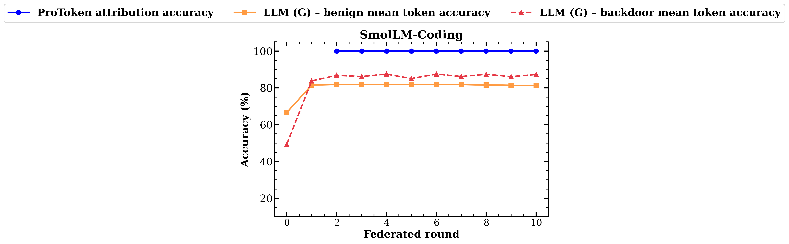
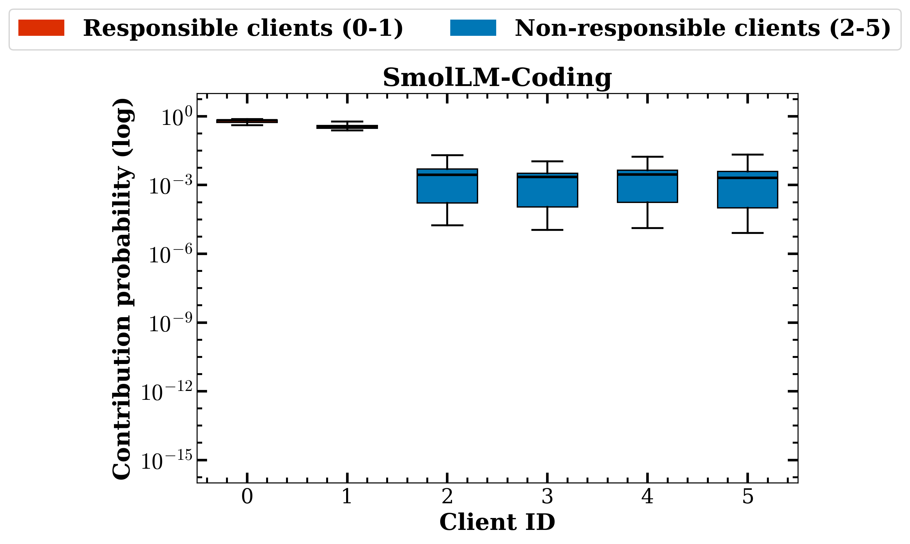
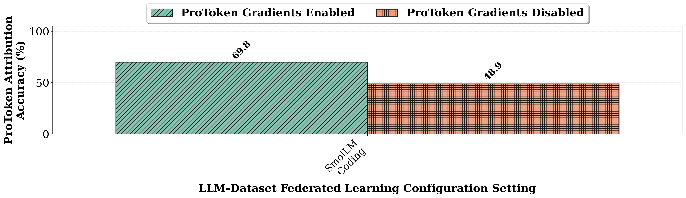
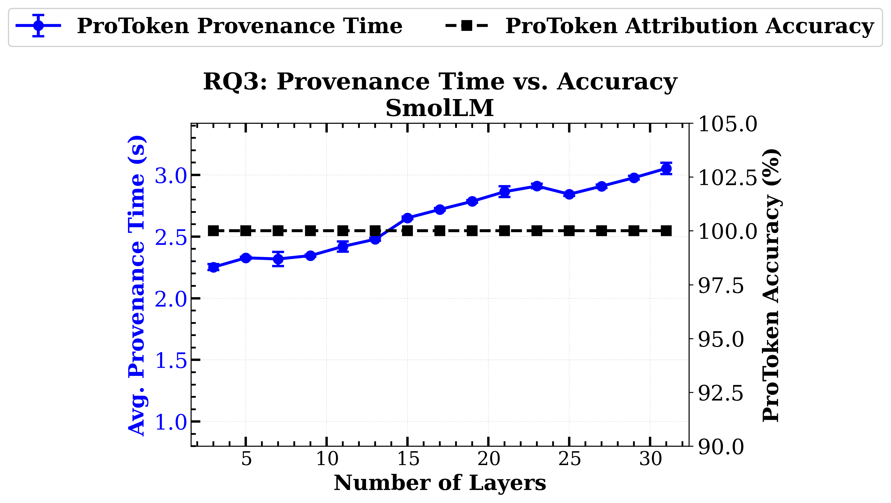
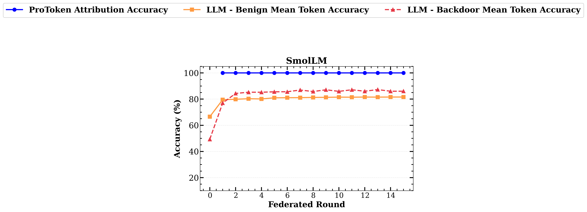
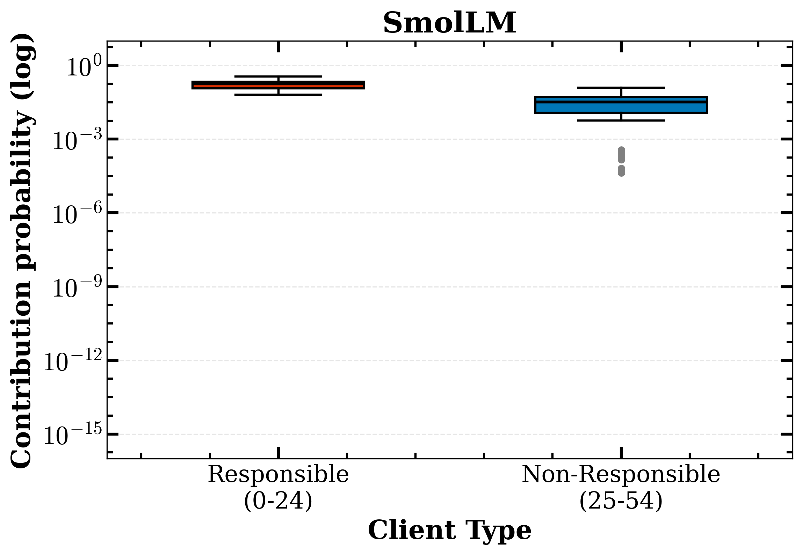

# ProToken: Token-Level Attribution for Federated Large Language Models

This repository is the artifact for the [MLSys 2026 paper](https://arxiv.org/pdf/2601.19672) with the same name.

## Overview

There are two ways to run this artifact and reproduce results: 
- If you are familiar with [Chameleon](https://chameleoncloud.org/), the most painless way to do this is use our [Trovi Artifact](https://trovi.chameleoncloud.org/dashboard/artifacts/0c08e6e5-1191-4774-8506-d951e8e7c15f). Open the link and click `Launch on Chameleon`. From there, open the `trovi-mlsys-ae.ipynb` file and follow the instructions. Note: You will need an active lease on Chameleon with appropriate hardware (detailed below) before you start. 

**OR**

- If you have access to your own hardware that you are comfotable using and that meets the requirements, you may continue following instructions in this README.

## 1: Pre-requisites

### 1A: Software Requirements

- A linux distribution (preferably Ubuntu)
- `git`, `uv`

### 1B: Hardware Requirements

- 1 x NVidia A100 GPU (or better)
- 512G RAM (or better)
- 512G of usable storage in `/tmp`

## 2: Setup

### 2A: Install `uv`

You may skip this step if you already have `uv` installed.

```
curl -LsSf https://astral.sh/uv/install.sh | sh
```

> Alternatively you may follow [instructions on the Astral website](https://docs.astral.sh/uv/getting-started/installation/)

### 2B: Installing Python libraries

### Using `uv` (recommended)

> NOTE: The following assumes that uv has been installed at `$HOME/.local/bin/uv`, which is the default location. If it has been installed elsewhere, please use the correct path.

```bash
$HOME/.local/bin/uv python install 3.12
$HOME/.local/bin/uv venv --python 3.12
$HOME/.local/bin/uv sync
```

## 3: Reproducing Results

The `reproduce.sh` script wraps the codebase to reproduce the paper's figures. The paper evaluates ProToken across 16 configurations (Model/Dataset combinations) with 6 clients over 10 rounds. Since running all of them would be prohibitively time-consuming, the commands below cover a single representative configuration i.e. `SmolLM` on the `coding` dataset for 10 rounds on 6 clients.

The expected time to run all the commands in this section is 2-3 hours.

### RQ1: How accurately does ProToken attribute token-level provenance? (Fig 2 & 3)

```bash
PATH=$PATH:~/.local/bin ./reproduce.sh --model smollm --dataset coding --rq1
```
> The command will produce two .png files in results/graphs/rq1. Open them and compare with reference outputs below.

RQ1 (a) — Main accuracy



*Important features:* Overall the ProToken attribution accuracy line should be higher than the baselines.

RQ1 (b) — Client contribution distributions



*Important features:* The mean contribution accuracy of the box plots for responsible clients should be higher (closer to 1) than Non-responsible clients.

---

### RQ2: How does gradient weighting (relevance filtering) affect attribution? (Fig 4)

```bash
PATH=$PATH:~/.local/bin ./reproduce.sh --model smollm --dataset coding --rq2
```
> The command will produce one .png file in results/graphs/rq2. Open it and compare with reference output below.



RQ2 — Gradient enable/disable

*Important features:* The "gradients enabled" bar should be higher than the "gradients disabled" bar.

---

### RQ3: What is the computational overhead vs. layer count? (Fig 5 — Tractability)

```bash
PATH=$PATH:~/.local/bin ./reproduce.sh --model smollm --dataset coding --rq3
```
> The command will produce one .png file in results/graphs/rq3. Open it and compare with reference output below.



RQ3 — Computational overhead

*Important features:* The average provenance time should increase as number of layers increases.

---

### RQ4: How does ProToken scale with more clients? (Fig 6 & 7)

```bash
PATH=$PATH:~/.local/bin ./reproduce.sh --model smollm --dataset coding --rq4
```
> The command will produce two .png files in results/graphs/rq4. Open them and compare with reference outputs below.


RQ4 (a) — Scalability



*Important features:* Same as for RQ1 (a)

RQ4 (b) — Scalability



*Important features:*  Same as for RQ1 (b)